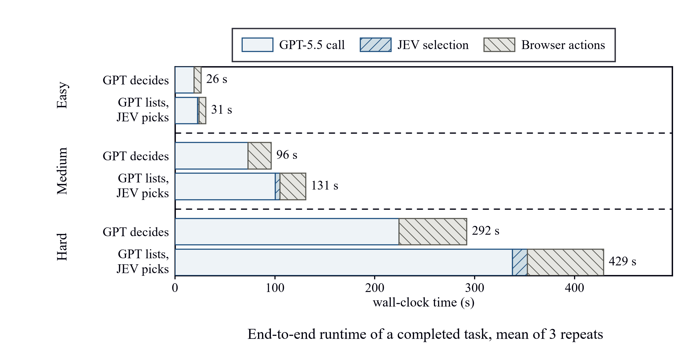
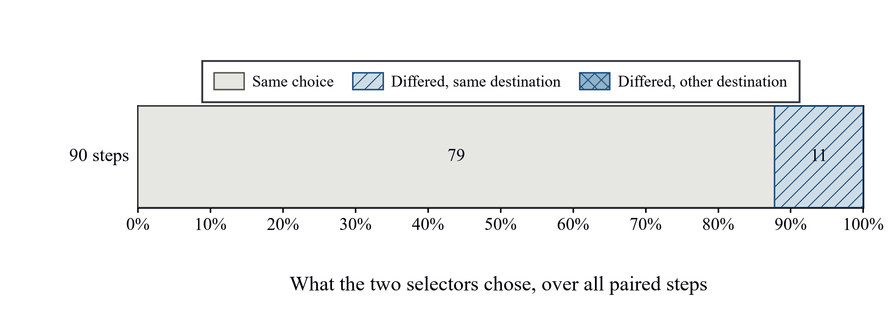
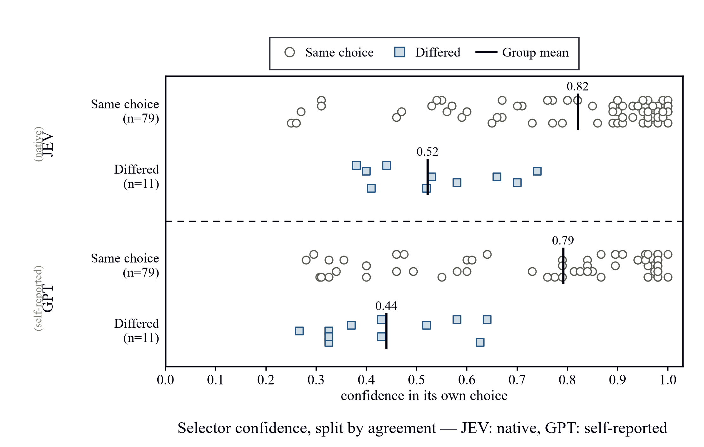

# JEV as a next-action selector for a web agent

A small, deliberately narrow benchmark that asks one question with the
measurement held still: **does swapping the next-action selector of a browser
agent from GPT-5.5 to JEV change what the agent decides, or how long it takes?**

An earlier version of this experiment reported that JEV cut runtime by 18.67%.
Auditing it showed the number was an artefact of the harness rather than a
property of the selector, so the protocol was rewritten first
([`experiment-v2.md`](experiment-v2.md)) and the experiment re-run against it.
This repository is the result: the guide, the code, the raw logs, and the
figures, with the claims trimmed to what the data supports.

---

## What was found

**The two selectors pick the same destination on every step.** Over 90 paired
decision steps they named the same candidate on 79 (87.8%). All 11 differences
were the same shape: one selector chose browser `back` while the other clicked a
category link to the listing both were heading to. Not one difference sent the
agent somewhere else.

**Both selectors are least sure exactly where they differ.** Mean confidence on
agreeing steps vs differing steps: JEV 0.82 → 0.52, GPT 0.79 → 0.44.

**The two-stage architecture costs more than JEV's faster selection saves.**
JEV's selection call is far quicker than a Codex-CLI selection call (0.68 s vs
10.97 s per call, against a measured floor of 4.07 s for *any* CLI call), but
generating a candidate set for it to choose from costs more than that saving:

| Arm | Codex calls / step | Total, 3 tasks | vs `single-call` |
|---|---:|---:|---:|
| `single-call` | 1 | 414.8 s | baseline |
| `gen+jev-select` | 1 (+ 1 JEV call) | 591.1 s | **+42.5%** |

**What is still unknown: whether JEV selects *better*.** With zero substantive
disagreements there is no evidence either way. This task set cannot tell the two
selectors apart, and the pre-registered decision rule in the guide says to
report that rather than reach for the latency number instead.

### Scope

The JEV integration measured here is handed candidates produced by GPT-5.5 at
high reasoning effort. The reference implementation published by browser-use
([`jev-ultrafast`](https://github.com/browser-use/jev-ultrafast)) does not work
this way: it extracts an indexed control table from the DOM deterministically
and issues one request that predicts operation and target together, calling a
small LLM only to write text.

So the runtime result above describes *one* integration of JEV, not the
architecture JEV is designed for. It says nothing about the
deterministic-extraction design, which was not run here. Figures from other
harnesses are not compared against these: a different site, task, browser
transport and text model make a direct time comparison the same category error
this protocol exists to avoid.

---

## Figures

| | |
|---|---|
|  | End-to-end runtime per task and arm, split by phase. |
|  | What the two selectors chose across all paired steps. |
|  | Each selector's confidence, split by whether the two agreed. |

Regenerate them from the retained logs with `python -m bench.graphs`.

---

## Arms

Names describe the configuration, because "GPT-5.5 only" reads as both of the
first two and that ambiguity is where the wrong comparison starts.

| Arm | Pipeline | LLM calls / step |
|---|---|---|
| `single-call` | GPT observes the page and commits to one action | 1 |
| `gen+gpt-select` | GPT lists candidates → GPT picks | 2 |
| `gen+jev-select` | GPT lists candidates → JEV picks | 1 + 1 JEV |
| `shadow` | GPT lists candidates → **both** selectors pick, one drives | 2 + 1 JEV |

Three comparisons, kept apart on purpose:

- **Main** — `gen+gpt-select` vs `gen+jev-select`. The only pair that holds the
  candidate set, the prompt and the trajectory constant and varies the selector
  alone. Run as the single `shadow` arm so both selectors share one generation
  call, which removes the per-step call-count difference between them.
- **Reference** — `single-call` vs `gen+jev-select`. Varies the architecture, so
  it answers "is the two-stage design worth building", not "is JEV good".
- **Separate** — `jev-only` (deterministic candidates, no LLM). A
  system-replacement question, reported on completion rate alone. Not
  implemented here; see the guide.

---

## Quick start

Requires **Windows**, **Python 3.11+**, **uv**, **Aside Browser**, and an
authenticated `codex` CLI. JEV arms also need a TypeSafe key.

```powershell
uv sync
$env:TYPESAFE_API_KEY = "your-key"      # read from the environment, not a .env file
```

Open exactly one Aside tab at `https://www.google.com/?jevbench=1` and leave it
open; the runner resets it between runs.

```powershell
# 1. Measure the fixed per-call cost of the CLI path, before anything else.
uv run python -m bench.floor

# 2. Main comparison: 9 runs (3 tasks x 3 repeats).
uv run python -m bench.batch --arm shadow

# 3. Metrics and the pre-registered verdict.
uv run python -m bench.analyze results\<batch-id>_shadow

# 4. Reference baseline, and the figures.
uv run python -m bench.batch --arm single-call
uv run --group viz python -m bench.graphs
```

`--levels easy medium hard` and `--repeats N` narrow a run. `--help` lists the
rest.

---

## Layout

```
bench/
  core.py            proven runtime: Codex CLI wrapper, Aside browser I/O,
                     candidate validation, the two selectors, run logging
  arms.py            arm definitions: planner, selectors, driver
  gpt_confidence.py  GPT selector that reports a probability per candidate
  runner.py          one run: the step loop, shadow recording, per-step JSONL
  batch.py           repeats, counterbalanced order, aggregation
  floor.py           the per-call floor measurement (guide 5.1)
  analyze.py         guide metrics and the pre-registered verdict
  graphs.py          the three figures
data/                the three fixed Books to Scrape tasks
results/             retained aggregates, analyses, floor, report
runs/                per-step trajectories for every run
experiment-v2.md     the protocol these results were produced under
```

`bench/core.py` is carried over unchanged from the earlier repository so results
stay comparable to the runtime that produced them. The old batch scripts and
step loop were not: the loop is rewritten in `runner.py` to record more than one
selector per step, and five overlapping batch runners are replaced by `batch.py`.

---

## How the measurement is kept honest

These are enforced in code, not left to the person running it:

- **Both selectors see the same candidate set.** The `shadow` arm consults them
  on one shared generation call.
- **The prompts differ by one paragraph.** Each arm's system prompt is derived
  from the shared planner prompt by replacing only the role sentence, and the
  code refuses to start if that paragraph has changed.
- **Latency is never corrected, only reported.** `bench.floor` measures the
  fixed cost of a CLI call; `analyze` prints both raw per-call numbers beside it.
  Measurement boundaries are recorded in every run summary, because the GPT
  selector is timed around a subprocess and JEV around an in-process SDK call —
  those two numbers are not the same kind of measurement.
- **Unfinished runs are never averaged.** A run that stops early has a small
  total that reads as a speed advantage it did not earn, so aggregation fails
  loudly and the figures skip such a batch.
- **The verdict follows a rule fixed before the run.** `analyze` selects it from
  the table in the guide; 100% agreement prints "these tasks cannot tell the
  selectors apart", not a latency claim.
- **Confidence is labelled by kind.** JEV's comes from the model; the GPT
  selector writes its probabilities out as text. The same formula is applied to
  both (taken from `system-one-adapter`, not retyped), and every record carries
  `confidence_kind` so a figure cannot forget the difference.

---

## Limitations

- One site, three tasks, three repeats per cell.
- The 11 differences are one recurring situation, not 11 independent judgement
  calls; the same task run three times produces the same choice point.
- GPT-5.5 is reached through the Codex CLI on a subscription, so its timings
  include process spawn and CLI startup. A model-to-model latency comparison
  would need both selectors behind the same API boundary.
- The GPT selector's prompt changed when it was asked to report probabilities,
  so its agreement rate and per-call latency are not continuous with runs made
  before that change.
- Token and monetary cost are not measured.
- Completion is self-reported by the agent; answers were inspected by hand. No
  official trajectory grader is integrated.
